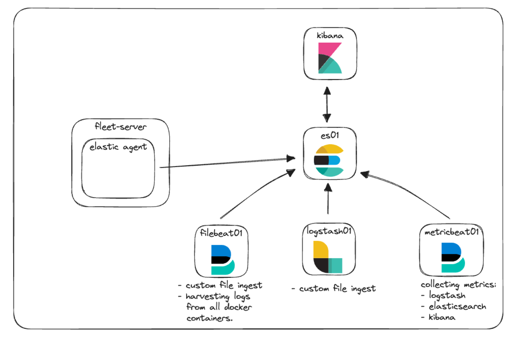

# ELK  구축 (1) - 단일 네트워크

## 들어가기 앞서

우선 모의 환경으로 로컬 PC 안에 ELK 를 구축하고, 그 안에 APM 에이전트를 붙인 webapp 을 모니터링을 하는 시나리오로 구축할 예정 입니다.

구성는 다음과 같이 하였습니다.

### 구성 환경

ELK version : 8.8.2

ELK Repo : [https://github.com/hyujikoh/elastic-stack-docker-part-two](https://github.com/hyujikoh/elastic-stack-docker-part-two)

Java version : 17

Java webapp Repo : [https://github.com/hyujikoh/UrlToKeyProject](https://github.com/hyujikoh/UrlToKeyProject)

Spring version : 3.2.4


### 구성도

<figure><figcaption><p>출처 : <a href="https://www.elastic.co/kr/blog/getting-started-with-the-elastic-stack-and-docker-compose-part-2">https://www.elastic.co/kr/blog/getting-started-with-the-elastic-stack-and-docker-compose-part-2</a></p></figcaption></figure>

## 본문

### DEMO APP APM Agent 생성

기존에 존재하던 webapp 대신 제가 준비한 UrlToKey 프로젝트에 APM 에이전트를 추가하고, 다음과 같이 dockerfile 에 아래와 같은 스크립트를 구성하였습니다.

<div align="center"><figure><figcaption></figcaption></figure></div>

```docker
# 베이스 이미지 선택 (Java 17 사용)
FROM openjdk:17

# 작업 디렉토리 설정
WORKDIR /app

# Maven 빌드 아티팩트를 컨테이너로 복사
COPY build/libs/ShortUrlProject-0.0.1-SNAPSHOT.jar /app/ShortUrlProject-0.0.1-SNAPSHOT.jar

# APM agent 파일 복사
COPY ./agent/elastic-apm-agent-1.52.1.jar /elastic-apm-agent-1.52.1.jar

# 컨테이너가 시작될 때 실행할 명령어
CMD ["java", "-javaagent:/elastic-apm-agent-1.52.1.jar", "-Delastic.apm.service_name=short-url-local" ,"-Delastic.apm.server_url=http://127.0.0.1:8200" ,"-Delastic.apm.environment=short-url"  ,"-Delastic.apm.application_packages=com.hyujikoh.ShortUrl" ,"-Delastic.apm.secret_token=1697b5ddea00af390d32b8fca3ccbd00", "-jar", "/app/ShortUrlProject-0.0.1-SNAPSHOT.jar"]
```

이렇게 하면 app 과 APM 서버가 통신을 하기 위한 준비는 모두 끝마쳤습니다.

### ELK 클러스터 생성

생성 자체는 매우 간단합니다.

ELK repo 에 존재하는 `docker-compose.yml` 를

```bash
docker compose up
```

명령어를 통해 elastic 네트워크로 구성된 elk 클러스터 데모 버전이 실행이 됩니다.

ELK repo 에서 가장 좋았던 부분은 다음과 같았습니다.

1.  인증서 자동 생성

    ELK 8.0 이상 부터는 APM 기능을 구성할려면 ELK 자체에 CA 와 인증서를 기반으로 하는 통신이 필수적으로 되어야 합니다. 이 부분을 setup 서비스가 CA 와 인증서를 자동으로 생성하는 함으로서 초기 설정이 간다하게 설정할수 있었습니다.
2.  독립적인 네트워크 및 서비스 관리

    elastic 라는 docker 네트워크를 설정함으로서 논리적으로 외부와 격리된 환경을 구축할 수 있고, 이를 통해 추후 외부 app 을 모니터링 하는데 일종의 사전 연습을 할수가 있었습니다.

이렇게 진행하기 전

이렇게 docker compose 를 이용해 컨테이너들은 다음과 같이 생성 되었습니다.

<figure><figcaption></figcaption></figure>

정상적으로 통신이 되었는지 확인을 하기 위해

[https://localhost:5601](https://localhost:5601) 로 들어가서 접속이 되는지 확인을 합니다.

<figure><figcaption></figcaption></figure>


정상적으로 접속이 된걸 확인하면 `.env` 파일에 있던 패스워드를 이용해 로그인을 진행합니다.

<figure><figcaption></figcaption></figure>


### Fleet 서버 출력 재구성, 인증서 추가

이렇게 진행하고, Managenet - Fleet 페이지로 들어가게 되면 Fleet 서버가 제대로 통신이 되지만, 메트릭 정보가 조회가 안되는걸 확인할수 있습니다.

<figure><figcaption></figcaption></figure>

Fleet 서버 컨테이너 로그를 확인했을때 다음과 같은 오류가 나왔습니다.

```docker
2025-01-16 18:48:33 {"log.level":"error","@timestamp":"2025-01-16T09:48:33.071Z","message":"Error dialing dial tcp [::1]:9200: connect: connection refused","component":{"binary":"metricbeat","dataset":"elastic_agent.metricbeat","id":"beat/metrics-monitoring",
"type":"beat/metrics"},"log":{"source":"beat/metrics-monitoring"},"log.origin":{"file.line":38,"file.name":"transport/logging.go"},"service.name":"metricbeat","network":"tcp","log.logger":"esclientleg","address":"localhost:9200","ecs.version":"1.6.0","ecs.version":"1.6.0"}
```

요약하자면 에이전트가 컨테이너에 적합하지 않은 Elasticsearch 인스턴스에 데이터를 기록하려고 해서 발생한 오류입니다.

이를 위해 Fleet 서버에 몇가지 업데이트를 진행해야합니다.


1. 출력 설정 수정\
   setting - Outputs 의 설정을 수정 합니다.&#x20;

<figure><figcaption></figcaption></figure>

2. CA 인증서 및 지문 추가\
   인증서 와 지문을 가져오기 위해 로컬 pc 에서 shell 명령어로 다음과 같이 입력 합니다.

```docker
docker cp es-cluster-es01-1:/usr/share/elasticsearch/config/certs/ca/ca.crt /tmp/.
```

또한 이렇게 가져온 인증서 지문을 생성하기 위해 다음과 같이 진행합니다.

<figure><figcaption></figcaption></figure>

마지막으로 `ca.crt` 의 인증서를 확인한다음 출력 설정 부분에 다음과 같이 설정 하면 끝입니다.

<figure><figcaption></figcaption></figure>

이렇게 설정값을 수정한 다음 deploy 후fleet 서버에 메트릭 정보가 나오면 정상적으로 설정이 완료 되었다는 뜻입니다.

<figure><figcaption></figcaption></figure>

<figure><figcaption></figcaption></figure>


## 참고자료





