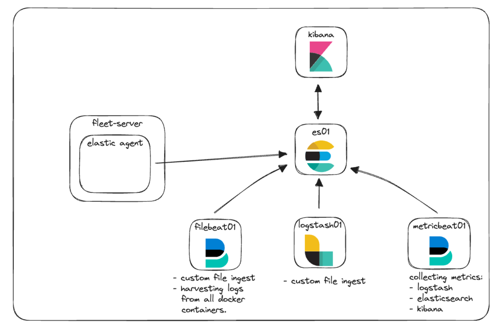

# ELK 구축 (1) - APM Agent 이용한 모니터링

## 들어가기 앞서

우선 모의 환경으로 로컬 PC 안에 ELK 를 구축하고, 그 안에 APM 에이전트를 붙인 Application 모니터링을 하는 시나리오로 구축할 예정 입니다.


여기서 다룬 예제 및 코드는 아래 포스트를 참고 및 기반으로 작성하였습니다.&#x20;



구성는 다음과 같이 하였습니다.

### 구성 환경

ELK version : 8.8.2

ELK Repo : [https://github.com/hyujikoh/elastic-stack-docker-part-two](https://github.com/hyujikoh/elastic-stack-docker-part-two)

Java version : 17

Java webapp Repo : [https://github.com/hyujikoh/UrlToKeyProject](https://github.com/hyujikoh/UrlToKeyProject)

Spring version : 3.2.4


### 구성도

<figure><figcaption><p>출처 : <a href="https://www.elastic.co/kr/blog/getting-started-with-the-elastic-stack-and-docker-compose-part-2">https://www.elastic.co/kr/blog/getting-started-with-the-elastic-stack-and-docker-compose-part-2</a></p></figcaption></figure>


### ELK Compose.yml 파일

각 elk 컨테이너를 생성하기 위한  `compose.ym`l 은 다음과 같다.

<details>

<summary>compose.yml</summary>

```yaml
version: "3.8"  # Docker Compose 버전

volumes: # 데이터 영구 저장 볼륨 정의 
  certs:
    driver: local
  esdata01:
    driver: local
  kibanadata:
    driver: local
  metricbeatdata01:
    driver: local
  filebeatdata01:
    driver: local
  logstashdata01:
    driver: local
  fleetserverdata:
    driver: local

networks:
  default:
    name: elastic # ELK 서비스가 통신할 네트워크 이름
    external: false


services:
  setup:
    image: docker.elastic.co/elasticsearch/elasticsearch:${STACK_VERSION}
    volumes:
      - certs:/usr/share/elasticsearch/config/certs # 인증서 볼륨 마운트
    user: "0" # 권한 설정을 위한 루트 사용자로 실행 
    command: >
      bash -c '
        if [ x${ELASTIC_PASSWORD} == x ]; then
          echo "Set the ELASTIC_PASSWORD environment variable in the .env file";
          exit 1;
        elif [ x${KIBANA_PASSWORD} == x ]; then
          echo "Set the KIBANA_PASSWORD environment variable in the .env file";
          exit 1;
        fi;
        if [ ! -f config/certs/ca.zip ]; then
          echo "Creating CA";
          bin/elasticsearch-certutil ca --silent --pem -out config/certs/ca.zip;
          unzip config/certs/ca.zip -d config/certs;
        fi;
        if [ ! -f config/certs/certs.zip ]; then
          echo "Creating certs";
          echo -ne \
          "instances:\n"\
          "  - name: es01\n"\
          "    dns:\n"\
          "      - es01\n"\
          "      - localhost\n"\
          "    ip:\n"\
          "      - 127.0.0.1\n"\
          "  - name: kibana\n"\
          "    dns:\n"\
          "      - kibana\n"\
          "      - localhost\n"\
          "    ip:\n"\
          "      - 127.0.0.1\n"\
          "  - name: fleet-server\n"\
          "    dns:\n"\
          "      - fleet-server\n"\
          "      - localhost\n"\
          "    ip:\n"\
          "      - 127.0.0.1\n"\
          > config/certs/instances.yml;
          bin/elasticsearch-certutil cert --silent --pem -out config/certs/certs.zip --in config/certs/instances.yml --ca-cert config/certs/ca/ca.crt --ca-key config/certs/ca/ca.key;
          unzip config/certs/certs.zip -d config/certs;
        fi;
        echo "Setting file permissions"
        chown -R root:root config/certs;
        find . -type d -exec chmod 750 \{\} \;;
        find . -type f -exec chmod 640 \{\} \;;
        echo "Waiting for Elasticsearch availability";
        until curl -s --cacert config/certs/ca/ca.crt https://es01:9200 | grep -q "missing authentication credentials"; do sleep 30; done;
        echo "Setting kibana_system password";
        until curl -s -X POST --cacert config/certs/ca/ca.crt -u "elastic:${ELASTIC_PASSWORD}" -H "Content-Type: application/json" https://es01:9200/_security/user/kibana_system/_password -d "{\"password\":\"${KIBANA_PASSWORD}\"}" | grep -q "^{}"; do sleep 10; done;
        echo "All done!";
      '
    # Elasticsearch와 Kibana 비밀번호 설정 수행을 위한 script
     
    # 인증서 생성 여부 확인하기 위한 test
    healthcheck:
      test: ["CMD-SHELL", "[ -f config/certs/es01/es01.crt ]"]
      interval: 1s
      timeout: 5s
      retries: 120


  es01:
    depends_on:
      setup:
        condition: service_healthy # Setup 서비스가 준비 되기 전까지 실행 X
    image: docker.elastic.co/elasticsearch/elasticsearch:${STACK_VERSION}
    labels:
      co.elastic.logs/module: elasticsearch
    volumes:
      - certs:/usr/share/elasticsearch/config/certs
      - esdata01:/usr/share/elasticsearch/data
    ports:
      - ${ES_PORT}:9200
      
    # elasticsearch 설정 
    environment: 
      - node.name=es01
      - cluster.name=${CLUSTER_NAME}
      - discovery.type=single-node
      - ELASTIC_PASSWORD=${ELASTIC_PASSWORD}
      - bootstrap.memory_lock=true
      - xpack.security.enabled=true
      - xpack.security.http.ssl.enabled=true
      - xpack.security.http.ssl.key=certs/es01/es01.key
      - xpack.security.http.ssl.certificate=certs/es01/es01.crt
      - xpack.security.http.ssl.certificate_authorities=certs/ca/ca.crt
      - xpack.security.transport.ssl.enabled=true
      - xpack.security.transport.ssl.key=certs/es01/es01.key
      - xpack.security.transport.ssl.certificate=certs/es01/es01.crt
      - xpack.security.transport.ssl.certificate_authorities=certs/ca/ca.crt
      - xpack.security.transport.ssl.verification_mode=certificate
      - xpack.license.self_generated.type=${LICENSE}
    mem_limit: ${ES_MEM_LIMIT}
    ulimits:
      memlock:
        soft: -1
        hard: -1
    healthcheck:
      test:
        [
          "CMD-SHELL",
          "curl -s --cacert config/certs/ca/ca.crt https://localhost:9200 | grep -q 'missing authentication credentials'",
        ]
      interval: 10s
      timeout: 10s
      retries: 120

  kibana:
    depends_on:
      es01:
        condition: service_healthy
    image: docker.elastic.co/kibana/kibana:${STACK_VERSION}
    labels:
      co.elastic.logs/module: kibana
    volumes:
      - certs:/usr/share/kibana/config/certs
      - kibanadata:/usr/share/kibana/data
      - ./kibana.yml:/usr/share/kibana/config/kibana.yml:ro
    ports:
      - ${KIBANA_PORT}:5601
    environment:
      - SERVERNAME=kibana
      - ELASTICSEARCH_HOSTS=https://es01:9200
      - ELASTICSEARCH_USERNAME=kibana_system
      - ELASTICSEARCH_PASSWORD=${KIBANA_PASSWORD}
      - ELASTICSEARCH_SSL_CERTIFICATEAUTHORITIES=config/certs/ca/ca.crt
      - XPACK_SECURITY_ENCRYPTIONKEY=${ENCRYPTION_KEY}
      - XPACK_ENCRYPTEDSAVEDOBJECTS_ENCRYPTIONKEY=${ENCRYPTION_KEY}
      - XPACK_REPORTING_ENCRYPTIONKEY=${ENCRYPTION_KEY}
      - XPACK_REPORTING_KIBANASERVER_HOSTNAME=localhost
      - SERVER_SSL_ENABLED=true
      - SERVER_SSL_CERTIFICATE=config/certs/kibana/kibana.crt
      - SERVER_SSL_KEY=config/certs/kibana/kibana.key
      - SERVER_SSL_CERTIFICATEAUTHORITIES=config/certs/ca/ca.crt
      - ELASTIC_APM_SECRET_TOKEN=${ELASTIC_APM_SECRET_TOKEN}
    mem_limit: ${KB_MEM_LIMIT}
    healthcheck:
      test:
        [
          "CMD-SHELL",
          "curl -I -s --cacert config/certs/ca/ca.crt https://localhost:5601 | grep -q 'HTTP/1.1 302 Found'",
        ]
      interval: 10s
      timeout: 10s
      retries: 120

  metricbeat01:
    depends_on:
      es01:
        condition: service_healthy
      kibana:
        condition: service_healthy
    image: docker.elastic.co/beats/metricbeat:${STACK_VERSION}
    user: root
    volumes:
      - certs:/usr/share/metricbeat/certs
      - metricbeatdata01:/usr/share/metricbeat/data
      - "./metricbeat.yml:/usr/share/metricbeat/metricbeat.yml:ro"
      - "/var/run/docker.sock:/var/run/docker.sock:ro"
      - "/sys/fs/cgroup:/hostfs/sys/fs/cgroup:ro"
      - "/proc:/hostfs/proc:ro"
      - "/:/hostfs:ro"
    environment:
      - ELASTIC_USER=elastic
      - ELASTIC_PASSWORD=${ELASTIC_PASSWORD}
      - ELASTIC_HOSTS=https://es01:9200
      - KIBANA_HOSTS=https://kibana:5601
      - LOGSTASH_HOSTS=http://logstash01:9600
      - CA_CERT=certs/ca/ca.crt
      - ES_CERT=certs/es01/es01.crt
      - ES_KEY=certs/es01/es01.key
      - KB_CERT=certs/kibana/kibana.crt
      - KB_KEY=certs/kibana/kibana.key
    command:
      -strict.perms=false

  filebeat01:
    depends_on:
      es01:
        condition: service_healthy
    image: docker.elastic.co/beats/filebeat:${STACK_VERSION}
    user: root
    volumes:
      - certs:/usr/share/filebeat/certs
      - filebeatdata01:/usr/share/filebeat/data
      - "./filebeat_ingest_data/:/usr/share/filebeat/ingest_data/"
      - "./filebeat.yml:/usr/share/filebeat/filebeat.yml:ro"
      - "/var/lib/docker/containers:/var/lib/docker/containers:ro"
      - "/var/run/docker.sock:/var/run/docker.sock:ro"
    environment:
      - ELASTIC_USER=elastic
      - ELASTIC_PASSWORD=${ELASTIC_PASSWORD}
      - ELASTIC_HOSTS=https://es01:9200
      - KIBANA_HOSTS=https://kibana:5601
      - LOGSTASH_HOSTS=http://logstash01:9600
      - CA_CERT=certs/ca/ca.crt
    command:
      -strict.perms=false

  logstash01:
    depends_on:
      es01:
        condition: service_healthy
      kibana:
        condition: service_healthy
    image: docker.elastic.co/logstash/logstash:${STACK_VERSION}
    labels:
      co.elastic.logs/module: logstash
    user: root
    volumes:
      - certs:/usr/share/logstash/certs
      - logstashdata01:/usr/share/logstash/data
      - "./logstash_ingest_data/:/usr/share/logstash/ingest_data/"
      - "./logstash.conf:/usr/share/logstash/pipeline/logstash.conf:ro"
    environment:
      - xpack.monitoring.enabled=false
      - ELASTIC_USER=elastic
      - ELASTIC_PASSWORD=${ELASTIC_PASSWORD}
      - ELASTIC_HOSTS=https://es01:9200

  fleet-server:
    depends_on:
      kibana:
        condition: service_healthy
      es01:
        condition: service_healthy
    image: docker.elastic.co/beats/elastic-agent:${STACK_VERSION}
    volumes:
      - certs:/certs
      - fleetserverdata:/usr/share/elastic-agent
      - "/var/lib/docker/containers:/var/lib/docker/containers:ro"
      - "/var/run/docker.sock:/var/run/docker.sock:ro"
      - "/sys/fs/cgroup:/hostfs/sys/fs/cgroup:ro"
      - "/proc:/hostfs/proc:ro"
      - "/:/hostfs:ro"
    ports:
      - ${FLEET_PORT}:8220
      - ${APMSERVER_PORT}:8200
    user: root
    environment:
      - SSL_CERTIFICATE_AUTHORITIES=/certs/ca/ca.crt
      - CERTIFICATE_AUTHORITIES=/certs/ca/ca.crt
      - FLEET_CA=/certs/ca/ca.crt
      - FLEET_ENROLL=1
      - FLEET_INSECURE=true
      - FLEET_SERVER_ELASTICSEARCH_CA=/certs/ca/ca.crt
      - FLEET_SERVER_ELASTICSEARCH_HOST=https://es01:9200
      - FLEET_SERVER_ELASTICSEARCH_INSECURE=true
      - FLEET_SERVER_ENABLE=1
      - FLEET_SERVER_CERT=/certs/fleet-server/fleet-server.crt
      - FLEET_SERVER_CERT_KEY=/certs/fleet-server/fleet-server.key
      - FLEET_SERVER_INSECURE_HTTP=true
      - FLEET_SERVER_POLICY_ID=fleet-server-policy
      - FLEET_URL=https://fleet-server:8220
      - KIBANA_FLEET_CA=/certs/ca/ca.crt
      - KIBANA_FLEET_SETUP=1
      - KIBANA_FLEET_USERNAME=elastic
      - KIBANA_FLEET_PASSWORD=${ELASTIC_PASSWORD}
      - KIBANA_HOST=https://kibana:5601

  demo-app:
    build:
      context: UrlToKeyProject
    volumes:
      - "/var/lib/docker/containers:/var/lib/docker/containers:ro"
      - "/var/run/docker.sock:/var/run/docker.sock:ro"
      - "/sys/fs/cgroup:/hostfs/sys/fs/cgroup:ro"
      - "/proc:/hostfs/proc:ro"
      - "/:/hostfs:ro"
    ports:
      - 9000:9000
```


</details>


## 본문

### DEMO APP APM Agent 생성

기존에 존재하던 webapp 대신 제가 준비한 UrlToKey 프로젝트에 APM 에이전트를 추가하고, 다음과 같이 dockerfile 에 아래와 같은 스크립트를 구성하였습니다.

<div align="center"><figure><figcaption></figcaption></figure></div>

```docker
# 베이스 이미지 선택 (Java 17 사용)
FROM openjdk:17

# 작업 디렉토리 설정
WORKDIR /app

# Maven 빌드 아티팩트를 컨테이너로 복사
COPY build/libs/ShortUrlProject-0.0.1-SNAPSHOT.jar /app/ShortUrlProject-0.0.1-SNAPSHOT.jar

# APM agent 파일 복사
COPY ./agent/elastic-apm-agent-1.52.1.jar /elastic-apm-agent-1.52.1.jar

# 컨테이너가 시작될 때 실행할 명령어
CMD ["java", "-javaagent:/elastic-apm-agent-1.52.1.jar", "-Delastic.apm.service_name=short-url-local" ,"-Delastic.apm.server_url=http://fleet-server:8200" ,"-Delastic.apm.environment=short-url"  ,"-Delastic.apm.application_packages=com.hyujikoh.ShortUrl" ,"-Delastic.apm.secret_token=1697b5ddea00af390d32b8fca3ccbd00", "-jar", "/app/ShortUrlProject-0.0.1-SNAPSHOT.jar"]
```

이렇게 하면 app 과 APM 서버가 통신을 하기 위한 준비는 모두 끝마쳤습니다.

### ELK 클러스터 생성

생성 자체는 매우 간단합니다.

ELK repo 에 존재하는 `docker-compose.yml` 를

```bash
docker compose up
```

명령어를 통해 elastic 네트워크로 구성된 elk 클러스터 데모 버전이 실행이 됩니다.

ELK repo 에서 가장 좋았던 부분은 다음과 같았습니다.

1.  인증서 자동 생성

    ELK 8.0 이상 부터는 APM 기능을 구성할려면 ELK 자체에 CA 와 인증서를 기반으로 하는 통신이 필수적으로 되어야 합니다. 이 부분을 setup 서비스가 CA 와 인증서를 자동으로 생성하는 함으로서 초기 설정이 간다하게 설정할수 있었습니다.
2.  독립적인 네트워크 및 서비스 관리

    elastic 라는 docker 네트워크를 설정함으로서 논리적으로 외부와 격리된 환경을 구축할 수 있고, 이를 통해 추후 외부 app 을 모니터링 하는데 일종의 사전 연습을 할수가 있었습니다.

이렇게 진행하기 전

이렇게 docker compose 를 이용해 컨테이너들은 다음과 같이 생성 되었습니다.

<figure><figcaption></figcaption></figure>

정상적으로 통신이 되었는지 확인을 하기 위해

[https://localhost:5601](https://localhost:5601) 로 들어가서 접속이 되는지 확인을 합니다.

<figure><figcaption></figcaption></figure>


정상적으로 접속이 된걸 확인하면 `.env` 파일에 있던 패스워드를 이용해 로그인을 진행합니다.

<figure><figcaption></figcaption></figure>


### Fleet 서버 출력 재구성, 인증서 추가

이렇게 진행하고, Managenet - Fleet 페이지로 들어가게 되면 Fleet 서버가 제대로 통신이 되지만, 메트릭 정보가 조회가 안되는걸 확인할수 있습니다.

<figure><figcaption></figcaption></figure>

Fleet 서버 컨테이너 로그를 확인했을때 다음과 같은 오류가 나왔습니다.

```docker
2025-01-16 18:48:33 {"log.level":"error","@timestamp":"2025-01-16T09:48:33.071Z","message":"Error dialing dial tcp [::1]:9200: connect: connection refused","component":{"binary":"metricbeat","dataset":"elastic_agent.metricbeat","id":"beat/metrics-monitoring",
"type":"beat/metrics"},"log":{"source":"beat/metrics-monitoring"},"log.origin":{"file.line":38,"file.name":"transport/logging.go"},"service.name":"metricbeat","network":"tcp","log.logger":"esclientleg","address":"localhost:9200","ecs.version":"1.6.0","ecs.version":"1.6.0"}
```

요약하자면 에이전트가 컨테이너에 적합하지 않은 Elasticsearch 인스턴스에 데이터를 기록하려고 해서 발생한 오류입니다.

이를 위해 Fleet 서버에 몇가지 업데이트를 진행해야합니다.


1. 출력 설정 수정\
   setting - Outputs 의 설정을 수정 합니다.&#x20;

<figure><figcaption></figcaption></figure>

2. CA 인증서 및 지문 추가\
   인증서 와 지문을 가져오기 위해 로컬 pc 에서 shell 명령어로 다음과 같이 입력 합니다.

```docker
docker cp es-cluster-es01-1:/usr/share/elasticsearch/config/certs/ca/ca.crt /tmp/.
```

또한 이렇게 가져온 인증서 지문을 생성하기 위해 다음과 같이 진행합니다.

<figure><figcaption></figcaption></figure>

마지막으로 `ca.crt` 의 인증서를 확인한다음 출력 설정 부분에 다음과 같이 설정 하면 끝입니다.

<figure><figcaption></figcaption></figure>

이렇게 설정값을 수정한 다음 deploy 를 한 다음 , Fleet 서버에 메트릭 정보가 나오면 정상적으로 설정이 완료 되었다는 뜻입니다.

<figure><figcaption></figcaption></figure>

<figure><figcaption></figcaption></figure>


### APM 서비스 APP 모니터링

APM 을 통해 다음과 같이 에이전트를 통해 모니터링되는 서비스를 확인할 수 있다.

<figure><figcaption></figcaption></figure>

<figure><figcaption></figcaption></figure>

<figure><figcaption></figcaption></figure>


## 후기

현재까지 진행한내용은 다음과 같다

* docker compose 를 이용하여, ELK 를 구축
* 동일한 컨테이너 네트워크 영역에 demo application 을 생성함으로 APM 모니터링 성공

사실 지금 방식이전에 레퍼런스와 문서를 참고하여 ELK 설치를 진행하고 실행해봤지만 \
안되는게 많아서 삭체 후 재설치를 무한 반복했다.&#x20;

그런 와중에 elastic 블로그에서 제공한 문서를 통해 간단하게 구현에 성공하였다.

다음 글에서는 ELK 클러스터와 다른 네트워크 영역에 있는 application 을 모니터링하는 방법에 대해 진행해보기로 하겠다.


## 참고자료





