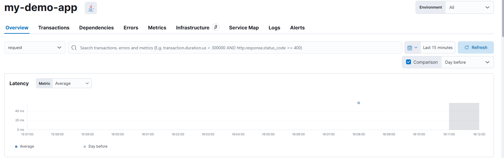

# ELK 구축 (2) - fluent bit 를 활용한 로그 모니터링

이전 게시글에서는 Docker 를 이용해 ELK 클러스터를 구축하고, 그 네트워크에 APM 에이전트를 붙인 demo application 을 컨테이너기반으로 서비스를 올려서 APM 상에 service 목록에 나오는것 까지 진행하였습니다.

이렇게만 하고 서비스를 모니터링을 잘 진행했다고 했을 경우에는 끝이 나겠지만 추가 요구사항이 있습니다.


1. 현재 실습 환경에서는 동일한 Docker 네트워크 영역으로 구성이 되어있다 . \
   즉, 외부 서드파트 앱에 대해서 로그 및 모니터링을 하는것이 아니다.
2. 어플리케이션 로그를 모니터링을 할수가 없음. 로그를 수집하기 위한 서비스 환경은 각각 다를수 있다.\
   (ex. K8S 내 파드 기반 서비스, 람다 기반 앱 서비스 등등)


<figure><figcaption></figcaption></figure>

1. logstash 와 , 쿠버네티스 기반 앱 서비스 모니터링을 동시에 하고 싶음,&#x20;
2. 모니터링 구조와 그런걸 구성

<figure><figcaption></figcaption></figure>

<figure><figcaption></figcaption></figure>

