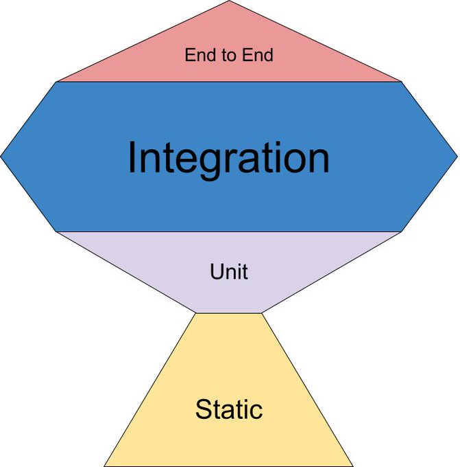

# for문과 Stream의 성능

## 들어가기 전에...

### 3줄 요약

1. 성능만 봤을때는, for 문이 Stream 이 성능이 좋긴하다.
2. 여러 병렬처리가 필요하다면 Stream을 사용하자.
3. 어느걸 써도 코드가 간결해야하고, 성능에 영향을 끼쳐서는 안된다.

### 글을 작성하게된 계기

> 처음 개발을 시작할때는 단순히 for 문을 통해 기능을 구현하였다. 공부를 하면서 Java 8 에서 나온 stream api 를 알게 되었지만, 뭔가 어렵게 느껴졌을뿐만 아니라 for 문을 사용하는게 편해서 멀리하게 되었다. 이후 로직을 구현하는데 있어 for 문으로 개발하는데 한계가 있었을 뿐만 아니라 개발 이후 리팩토링을 하는데 있어 번잡하게 작성된 코드로 인해 가독성이 떨어지는 문제를 겪었다. 물론 단순히 for 문을 사용했다는 이유 때문에 이런 문제가 발생되지는 않았지만, 원인이 되었던적이 빈번하였다. 이때부터 코드의 가독성과 간결함을 유지하기위해 Stream API 를 사용하였다. 사용하다 보니 익숙해졌을 뿐만 아니라 맘대로 Stream API 가 좋다고 인식이 박히게 되었다. 이번 글을 통해 두 기능에 대해 이해할 수 있으면 좋겠다.

***

### 고정 관념을 부수기 위한 성능테스트

테스트 하기전 나는 Stream API(이하 스트림)가 for 문보다 엄청나게 성능이 좋고 코드를 간결하게 만들어 주는 기능이라고 생각을 하였다.&#x20;

실제로 맞는 내용인지 간단한 테스트 코드를 통해 성능 측정을 하였다.

```java
public class apiTest {
    List<Long> data =  LongStream.rangeClosed(1, 10000)
            .boxed()
            .collect(Collectors.toList());

    @Test
    public void forTest(){
        long beforeTime = System.nanoTime(); //코드 실행 전에 시간 받아오기
        long sum = 0;
        for (long i:
             data) {
            sum+=i;
        }
        long afterTime = System.nanoTime(); // 코드 실행 후에 시간 받아오기
        long secDiffTime = afterTime - beforeTime; //두 시간에 차 계산
        System.out.println("테스트 A 시간차이(m) : "+secDiffTime);
    }

    @Test
    public void forStream(){
        long beforeTime = System.nanoTime(); //코드 실행 전에 시간 받아오기
        long sum = data.stream().mapToLong(
                s -> s
        ).sum();
        long afterTime = System.nanoTime(); // 코드 실행 후에 시간 받아오기

        long secDiffTime = afterTime - beforeTime; //두 시간에 차 계산
        System.out.println("테스트 B 시간차이(m) : "+secDiffTime);
    }
}

```

list 의 길이를 `10000` 으로 했을때 다음과 같은 결과가 나온다.&#x20;

<div align="left">

<figure><figcaption><p>list size가 <code>10000</code> 일때 각각 테스트 결과</p></figcaption></figure>

</div>

list 의 길이를 `10000000` 으로 했을때는 성능 결과는 다음과 같다.

<div align="left">

<figure><figcaption><p>list size가 <code>10000000</code> 일때 각각 테스트 결과</p></figcaption></figure>

</div>

결과만 봤을때는 for 문이 스트림보다 성능이 더 좋다. 그렇다면 왜 스트림을 사용하는 걸까?


