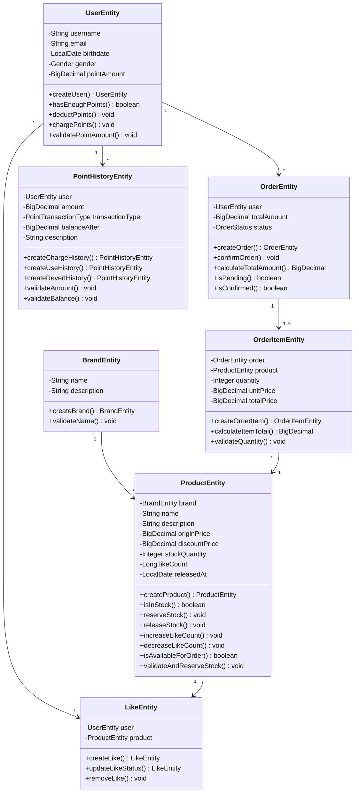

# 요구사항, E-R , ERD까지, 공사를 위한 설계도 만들기

### 서론: 이 글을 작성하게 된 이유 <a href="#undefined" id="undefined"></a>

새벽에 일어나 건설 현장에서 안전모를 쓰고 작업했던 시절이 있었습니다.\
작업 일정표대로 진행하는 게 원칙이지만, 현장은 언제나 예상과 달랐습니다.

지반 안정성 측량도 하고, 안전감리도 거치지만, 겨울에는 얼어붙은 땅 때문에 시멘트 사이 공백이 생기지 않도록 건조 작업이 필요했고, 자재 수급이 늦어지면 전체 일정이 밀려났다. 설계도는 완벽했지만, 현장은 늘 변수투성이었습니다.

그렇다면 설계도의 가치는 뭘까?

지금 돌이켜보면, 설계도는 **모든 것을 미리 정해놓은 설명서** 가 아니라, \
**팀 전체가 같은 목적지를 바라보게 해주는 지도**였다고 생각합니다.

***

개발하면서 많은 프로젝트를 진행할때도 마찬가지였습니다.

확실하게 정의되지 않고 시작을 했을떄,\
디자인팀, 기획팀, 프론트엔드, 백엔드 모두가 각자 다른 해석으로 움직였습니고, 아래와 같은 질문들이 나왔습니다.

* "이 버튼 클릭하면 어떤 API가 호출되나요?"
* "주문과 상품의 관계가 어떻게 되죠?"
* "좋아요 중복 방지는 프론트에서 하나요, 백에서 하나요?"

이 글을 쓰게된 이유도 프로젝트 팀원들의 싱크를 맞추고 같은 방향을 바라보게 하기위한 요구사항 문서 부터 시작해서, 시퀀스 다이어그램, 클래스 다이어그램, ERD를 그린 과정을 작성한 글이다.

### 1. 요구사항 정의: 사용자가 원하는 게 뭔지부터 <a href="#id-1" id="id-1"></a>

개발자에게 문서정리는 중요하지만 반대로 가장 멀기도 한 작업입니다.

커머스 시스템을 만들자라는 목표만 있을 뿐, 사용자가 실제로 무엇을 필요로 하는지 정리된 게 없었습니다.

그래서 가장 먼저 한 일은 **요구사항 문서 작성**이었습니다.

대규모 커머스를 운영하는 회사에서 소개한 내용중에 아래와 같은 주제를 공유한걸 봤습니다.

> "추상적인 '고객 중심'은 구체적인 시스템으로 구현될 때 비로소 지속 가능한 성과로 이어진다."

저도 막연한 "좋은 커머스"가 아니라, 구체적인 사용자 니즈부터 정의하기로 했습니다.

***

문서로 작성을 시작하기 전에 막연하게 요구사항을 직접 작성해보면서 그걸 다이어그램도 그려봤습니다.

가장 먼저 한 일은 종이를 펴고 사용자 여정을 그려보는 것이었습니다.

* 사용자가 상품을 보고
* 여러개 상품을 담아 주문 및 결제를 한다.
* 상품마다 좋아요를 누르는 흐름

이걸 적으면서 "장바구니에 담은 상품을 어떻게 주문으로 연결하지?"\
같은 질문들이 자연스럽게 떠올랐습니다.

#### 고민: 사용자 요구사항 정의 이외 문제정의

기능만 나열하다 보니, 또 다른 질문이 생겼습니다.

* 좋아요를 실수로 두 번 누르면?
* 두 사람이 동시에 마지막 재고를 주문하면?
* 주문한 뒤에 가격이 바뀌면?

문제를 정의했지만, 정의한 문제속에 또다른 문제가 정의가 되었습니다. 개발관점에서는 다음과 같은 것들로 도출될수 있습니다.

* **멱등성**: 같은 행동을 반복해도 결과가 같아야 함
* **동시성**: 여러 사용자가 동시에 접근해도 안전해야 함
* **데이터 정합성**: 과거 데이터가 현재 정보로 덮어씌워지면 안 됨

이런식으로 우리의 서비스를 사용하는 사용자들은 어떤게 필요한지 종이로 끄적이던 것들을 요구사항이라는 성격을 가진 문서가 만들어졌습니다.

````markdown
## 📖 유저 시나리오

### 핵심 사용자 여정
```
1. 사용자가 이커머스 사이트에 접속
2. 다양한 브랜드의 상품들을 둘러보며 탐색
3. 마음에 드는 상품에 좋아요 등록
4. 여러 상품을 선택하여 한 번에 주문
5. 보유 포인트로 간편 결제 완료


## 시나리오 1 : 상품 발견과 탐색

### 유저 스토리
> **"다양한 상품을 찾아보고 싶다."**

**상황**: 사용자가 새로운 상품을 찾거나 특정 조건의 상품을 탐색하려는 경우
**핵심 니즈**: 
- 적당한 양의 상품을 압도되지 않게 보기 
- 개인 취향/예산에 맞는 상품 빠르게 탐색
- 인기/최신 상품 우선 확인


## 시나리오 2 : 브랜드 중심 쇼핑

### 유저 스토리
> **"내가 좋아하는 브랜드의 다른 상품들도 보고 싶어요"**

**상황**: 특정 브랜드에 관심이 생겼거나 브랜드 충성도가 높은 사용자 (ex. 무신사 스탠다드)
**니즈**:
- 브랜드가 어떤 정체성을 가진지 알고 싶음
- 해당 브랜드의 다른 상품들도 함께 탐색하고 싶음


## 시나리오 3 : 관심 상품 관리 (좋아요)

### 유저 스토리
> **"마음에 드는 상품을 표시해두고 나중에 다시 보고 싶어요"**

**상황**: 탐색 중 마음에 드는 상품을 발견했지만 즉시 구매하지는 않는 경우
**니즈**:
- 관심 상품을 간단하게 표시하고 싶음
- 실수로 여러 번 눌러도 문제없이 동작했으면 함
- 나중에 관심 표시한 상품들을 모아서 보고 싶음
- 다른 사람들은 어떤 상품을 좋아하는지 궁금함


## 시나리오 4 : 상품 주문

### 유저 스토리
> **"여러 상품을 한 번에 주문하고 포인트로 결제하고 싶다"**

**상황**: 탐색과 좋아요를 통해 구매할 상품들을 정했고 실제 주문하려는 상황
**니즈**:
- 장바구니처럼 여러 상품을 한 번에 주문하고 싶음
- 복잡한 결제 과정 없이 간단하게 구매하고 싶음
- 재고나 포인트 문제가 있으면 주문 전에 미리 알고 싶음
- 주문 후 내역을 확인하고 싶음
````

***

### 2장. 시퀀스 다이어그램: 흐름을 그리다 <a href="#id-2" id="id-2"></a>

요구사항을 나름 작성했다고 생각했지만, 꼬리에 꼬리는 무는 질문이 나왔습니다.

* 상품 조회는 어떤 순서로 처리돼야 하지?
* 주문 생성할 때 상품 정보를 언제 가져오지?
* 좋아요 중복은 어디서 확인하지?

**요구사항은 '무엇을(What)' 말해주지만, '어떻게(How)' 와 '순서(When)'는 말해주지 않았습니다.**

이 과정에서 다시 A4 용지로 끄적이면서 다시 작성하고, 핵심 흐름만 그리고, 세부사항은 생략했습니다.

```
# 🔄 02. 시퀀스 다이어그램 (구체적인 시퀸스는 생략하겠습니다.)

## 1. 상품 목록 조회

## 2. 상품 상세 조회

## 3. 브랜드 목록 조회

## 4. 브랜드 상세 조회

## 5. 좋아요 등록

## 6. 좋아요 취소

## 7. 내가 좋아요한 상품 목록 조회

## 8. 주문 요청

### 🔒 주문 처리 원자성 보장

#### **트랜잭션 전략**
- **보상 트랜잭션**: 실패 시점에 따른 롤백 전략
  - 재고 예약 실패 → 이미 예약된 재고 즉시 해제
  - 포인트 차감 실패 → 예약된 모든 재고 해제  
  - 주문 생성 실패 → 포인트 복구 + 재고 해제

## 9. 사용자의 주문 목록 조회

## 10. 주문 상세 조회
```

타임아웃, 캐싱, 데드락 등 추상적인 다이어그램에 기술적인 구체화는 생략하고, 에러 처리, 멱등성등 최소한에 대해서만 요구사항을 작성하였습니다.

왜냐하면 개발하면서 또 바뀔 거고, 중요한 건 **"이 순서로 흐른다"는 큰 그림**이기 때문입니다.

완벽한 다이어그램보다, **팀이 같은 흐름을 이해하는 것**이 더 중요하다 생각했습니다.

### 3장. 클래스 다이어그램: 관계를 정의하다 <a href="#id-3" id="id-3"></a>

시퀀스로 "흐름"을 정리했지만, 여전히 부족했습니다.

* 상품과 주문은 어떤 관계지?
* 좋아요는 사용자와 상품 양쪽을 연결하는데, 어떻게 표현하지?
* 브랜드와 상품은 1:N 관계인가?

다시 A4 용지에 꺼내다 끄적거리면서 다이어 그램을 대략으로나마 작성해봤습니다.

````yaml
## 전체 도메인 모델


````

이 다이어그램을 구체적으로 작성했을때도 필요한 부분만 포함하고 무의미한 메서드는 생략했습니다.

* 모든 필드를 다 적지 않았습니다 (핵심이 눈에 안보일거라 생각했습니다.)
* 메서드도 핵심만 적었습니다 (어떤 메서드가 필요한다고 해도, 나중가면 필요없을수있다 생각했습니다.)
* getter/setter 같은 건 생략했습니다 (역시나 핵심만 )

왜냐하면 중요한 건 어떤 관계인지, 필드가 몇 개인가가 아니기 때문에 핵심만을 담아서 제공하는게 맞다고 느꼈습니다.

***

### 4장. ERD: 실제 테이블로 옮기다 <a href="#id-4-erd" id="id-4-erd"></a>

클래스 다이어그램으로 관계를 정의했으니, 이제 실제 DB 테이블 설계를 해야 했습니다.

이 부분을 작성할때는 비즈니스에 대한 요구사항과 미스매칭이 되지 않도록 erd 에서도 최대한 반영하고자 하였습니다.

**좋아요 테이블 - 멱등성 보장**

```yaml
likes (좋아요)

**목적**: 사용자의 상품 좋아요 정보 관리

| 컬럼명 | 타입 | 제약조건 | 설명 |
|--------|------|----------|------|
| id | BIGINT | PK, AUTO_INCREMENT | 좋아요 고유 식별자 |
| user_id | BIGINT | NOT NULL, UNIQUE (with product_id) | 사용자 ID (users.id) |
| product_id | BIGINT | NOT NULL, UNIQUE (with user_id) | 상품 ID (products.id) |
| created_at | TIMESTAMP | NOT NULL | 좋아요 등록 시간 |
| updated_at | TIMESTAMP | NOT NULL | 수정일시 |
| deleted_at | TIMESTAMP | NULL | 삭제일시|

**인덱스**:
- `idx_like_user_id`: user_id (사용자별 좋아요 목록 조회)
- `uk_like_user_product`: (user_id, product_id) UNIQUE (중복 방지)

```

**주문 테이블 - 주문 당시 가격 정보 저장**

```yaml
orders (주문)

**목적**: 사용자의 주문 정보 관리

| 컬럼명 | 타입 | 제약조건 | 설명 |
|--------|------|----------|------|
| id | BIGINT | PK, AUTO_INCREMENT | 주문 고유 식별자 |
| user_id | BIGINT | NOT NULL | 사용자 ID (users.id) |
| total_amount | DECIMAL(10,2) | NOT NULL | 총 주문 금액 |
| status | VARCHAR(20) | NOT NULL | 주문 상태 (PENDING/CONFIRMED) |
| ordered_at | TIMESTAMP | NOT NULL | 주문 일시 |
| created_at | TIMESTAMP | NOT NULL | 생성일시 |
| updated_at | TIMESTAMP | NOT NULL | 수정일시 |
| deleted_at | TIMESTAMP | NULL | 삭제일시|

**인덱스**:
- `idx_order_user_id`: user_id (사용자별 주문 목록 조회)
- `idx_order_status`: status (상태별 주문 조회)


order_items (주문 상세)

**목적**: 주문에 포함된 개별 상품 정보 관리

| 컬럼명 | 타입 | 제약조건 | 설명 |
|--------|------|----------|------|
| id | BIGINT | PK, AUTO_INCREMENT | 주문 상세 고유 식별자 |
| order_id | BIGINT | NOT NULL | 주문 ID (orders.id) |
| product_id | BIGINT | NOT NULL | 상품 ID (products.id) |
| quantity | INT | NOT NULL | 주문 수량 (1 이상) |
| unit_price | DECIMAL(10,2) | NOT NULL | 단가 (주문 시점의 상품 가격) |
| total_price | DECIMAL(10,2) | NOT NULL | 총 가격 (unit_price * quantity) |
| created_at | TIMESTAMP | NOT NULL | 생성일시 |
| updated_at | TIMESTAMP | NOT NULL | 수정일시 |
| deleted_at | TIMESTAMP | NULL | 삭제일시|
```

ERD를 그리면서도 최소한만 정의했습니다.

* 인덱스는 나중에 성능 문제 생기면 추가
* 제약조건은 핵심(PK, FK, UNIQUE)만

왜냐하면 실제 데이터가 쌓이고 사용해봐야, 어떤 인덱스가 필요한지 알 수 있기 때문입니다.

***

### 결론: 설계는 살아있는 지도다 <a href="#undefined" id="undefined"></a>

건설 현장에서 배운 것처럼, 설계도는 완벽할 수 없습니다.\
겨울엔 땅이 얼고, 자재가 늦게 오고, 예상치 못한 변수가 생깁니다.

소프트웨어도 마찬가지인것 같습니다.

이번에 작성한 요구사항, 시퀀스, 클래스, ERD는 절대적으로 완벽한 **설계서**가 아닙니다.\
다만 **팀이 같은 목적지를 바라보게 하는 지도**입니다.

이번 주차에 배운것에서 느낀것은 다음과 같습니다.

**1. 문서는 살아있어야 한다**\
한 번 쓰고 끝이 아니다. 개발하면서 계속 업데이트되어야 합니다.

**2. 완벽함보다 실용성**\
모든 디테일을 적으려 하지 말고, 핵심만 명확하게 정리하면 됩니다.

**3. 그림이 말보다 빠르다**\
10분 설명할 내용을 다이어그램 하나로 10초 만에 전달할 수 있어야 한다.

***

### 마지막으로

이 문서들이 완벽하다고 생각하지 않습니다.\
개발하면서 또 바뀔 것이고, 새로운 문제가 발견될 것입니다.

하지만 적어도 제가 뭘 시작하기 어려울때면 일단 종이에다 끄적이면서 제가 뭘 해야하는걸 정리하는걸로 시작합니다.

요구사항부터 시작해서, 시퀀스로 흐름을 잡고, 클래스로 관계를 정의하고, ERD로 구체화하는 이 과정들이&#x20;

저에게는 목적지로 가는 지도를 그리는 방법 이었습니다.

나중에 팀원이 합류하더라도, 이 문서들을 보면 같은 방향을 보는걸로 시작하고 \
그게 바로 설계 문서의 진정한 가치라고 생각합니다.
